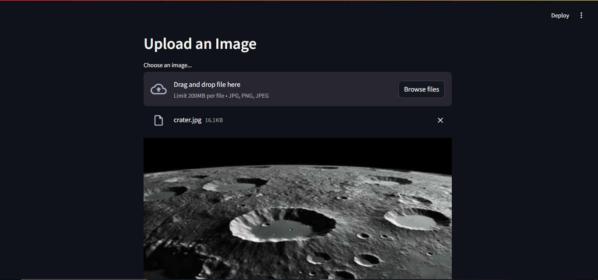
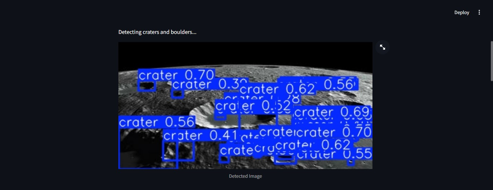
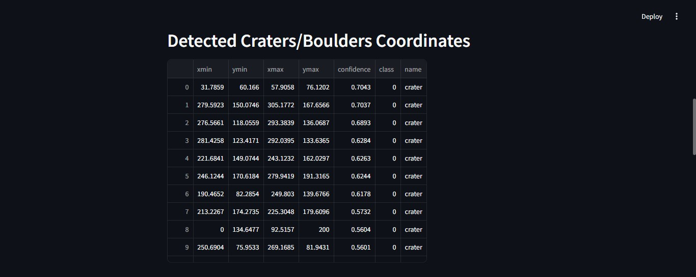
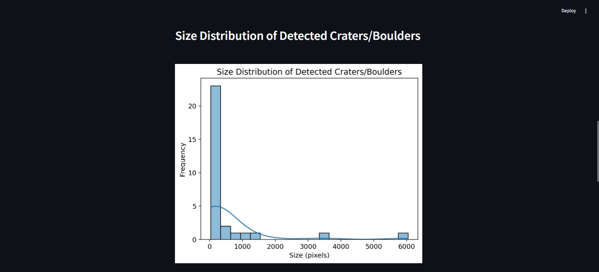
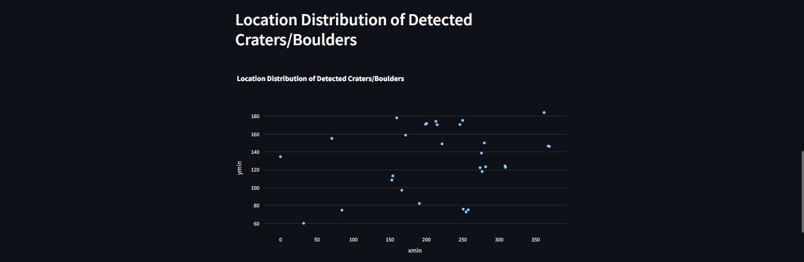

# Crater-Detection-System

Crater Detection System is a computer vision-based tool that detects and analyzes lunar craters from satellite images using image processing and machine learning. It assists in lunar research, rover navigation, and geological mapping by identifying crater shapes, sizes, and locations accurately.

## 🖼️ Screenshot

